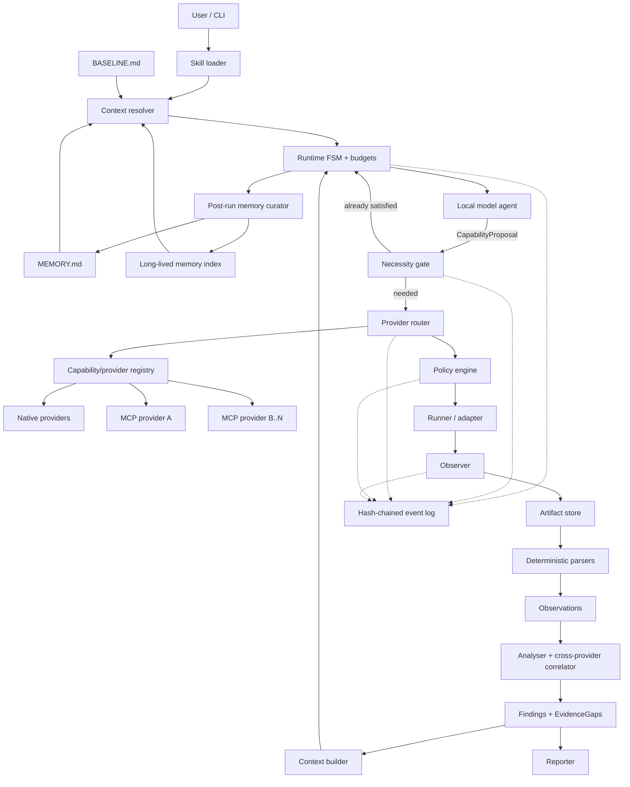

# 01 — Architecture

## 1. Governing principle: deterministic spine, local probabilistic brain

The harness separates what must be provable from what benefits from judgement.

| | Deterministic spine | Local probabilistic brain |
|---|---|---|
| Owns | run lifecycle, state, budgets, memory policy, provider necessity, routing, scope, tool invocation, parsing, evidence, findings, replay | proposing the next information need, hypotheses, final narrative |
| Property | reproducible, unit-testable, auditable | non-deterministic, evaluated statistically |
| Default location | local process / containers | local inference endpoint |

The model does **not** directly decide which MCP server to call. It asks for a typed capability;
the spine determines whether another call is necessary and which provider or provider set is the
minimum sufficient way to satisfy it.

## 2. Layers



The evidence graph and memory are separate on purpose. Evidence answers **what happened in this
run?** Memory answers **what context may help the next run?** Memory may point back to prior run
ids, but it cannot satisfy a current finding's evidence invariant.

## 3. Local-first model runtime

The default `ModelClient` connects only to a configured local endpoint (localhost/Unix socket).
The backend is adapter-based so Ollama-, llama.cpp-, vLLM-, or OpenAI-compatible local servers
can be used without changing the runtime contract.

A run freezes:

```text
model_backend
model_id / model_digest when available
context_window
local tokenizer id/version
sampling parameters
system prompt digest
```

Remote inference is an optional adapter, disabled by default. Enabling it requires explicit
configuration and a data-egress policy. The runtime must never silently send raw artifacts,
long-lived memory, or retrieved evidence to a remote model.

## 4. Capability proposal contract

The model requests a logical capability rather than naming an implementation:

```json
{
  "plan": [
    {"step": 1, "capability": "service.enumerate", "intent": "identify exposed services"},
    {"step": 2, "capability": "vulnerability.match", "intent": "map versions to candidate CVEs"}
  ],
  "next_action": {
    "kind": "capability",
    "grant": "g-7f21",
    "capability": "service.enumerate",
    "args": {"target": "lab-web-01", "profile": "service_detection"},
    "expects": "service, product, version and CPE observations",
    "evidence_needed": "No current service observations exist for the granted target."
  }
}
```

The spine validates capability, grant, arguments and preconditions. Provider identities are not
required in the model output. A skill may restrict which provider classes are allowed.

## 5. Provider necessity gate

Availability is not necessity. Before any native tool or MCP call, the gate asks:

1. Can existing current-run evidence satisfy the requested need?
2. Is there a cached result with valid provenance and acceptable freshness?
3. What is the cheapest/risk-lowest provider that can fill the remaining evidence gap?
4. Is a second provider actually required?

v1 is deliberately rule-based. It selects one provider by default. Additional providers are
allowed only for one of these recorded reasons:

- `coverage_gap`: one provider cannot cover the requested protocol/source/field;
- `conflict_resolution`: existing providers disagree materially;
- `independent_verification`: the skill/finding requires independent corroboration;
- `provider_failure`: the first provider failed, timed out, or returned an EvidenceGap;
- `trust_diversity`: a high-impact conclusion should not depend on one untrusted external source.

Default caps: one provider per capability request, two when a multi-provider reason is present,
and three only with an explicit skill override plus budget headroom. The runtime logs the chosen
set and rejected candidates so token/tool efficiency is measurable.

This is **not** the v2 Token Optimizer. It is a simple safety/cost gate whose behaviour can be
unit-tested.

## 6. Investigation loop

1. Resolve context from user input, defaults, `BASELINE.md`, bounded `MEMORY.md`, and selective
   long-lived-memory retrieval.
2. Freeze run configuration, scope, model metadata, memory snapshot digests and budgets.
3. Build a capability catalogue from skill grants and provider availability.
4. Ask the local model for one `CapabilityProposal` plus its advisory plan.
5. Validate the proposal.
6. Run the necessity gate. If existing evidence is sufficient, record `CALL_SKIPPED` and re-plan.
7. Route to the minimum sufficient provider set.
8. Policy-gate each concrete provider invocation (`allow` / `ask` / `deny`).
9. Execute in the sandbox; capture raw output as immutable artifacts.
10. Parse and normalize into typed observations tagged with provider/source.
11. Correlate provider results; preserve agreement, complement and conflict as structured state.
12. Derive findings through deterministic rules/matchers; the model cannot author a CVE finding.
13. Check termination/budgets and repeat if needed.
14. Render the report.
15. Run the post-run memory curator: propose bounded active-memory updates and durable long-lived
    entries; validate, archive, compact if needed.

## 7. Memory architecture

Three tiers are intentionally different:

```text
memory/BASELINE.md      stable human-curated rules/configuration; always loaded
MEMORY.md               bounded active working set; always loaded; compacted
memory/long_term/*      durable entries; locally indexed; retrieved selectively
```

`MEMORY.md` is small by contract. When it exceeds its configured ceiling, the spine snapshots it,
deduplicates entries, promotes durable items to long-lived storage, and rewrites a compact active
set. The local model may propose a compaction summary, but the old snapshot remains auditable.

Long-lived memory uses local SQLite FTS5 in v1; no vector database is required. Retrieval results
carry source run ids and are labeled `memory_context` in prompts.

**Memory cannot satisfy an evidence requirement.** A statement remembered from yesterday can tell
the planner what to inspect today; it cannot prove today's finding.

## 8. Cross-provider normalization

Every provider invocation produces a common envelope:

```json
{
  "provider": "native:nmap" ,
  "capability": "service.enumerate",
  "execution_id": "x-...",
  "artifact": "sha256:...",
  "freshness": "2026-09-15T...Z",
  "trust_class": "local_tool",
  "observations": ["o-..."],
  "gaps": []
}
```

The correlator never chooses a winner by prose. It computes keyed agreements/conflicts over
normalized observations. A conflict becomes structured state and may justify another provider
only if the necessity gate says the extra call is worth its bounded cost in v1.

## 9. Budgets and v1 token guard

v1 retains hard limits for steps, tool/provider calls, prompt tokens, wall clock, artifact bytes
and consecutive failures. It adds:

- a per-run token ledger;
- a per-step context ceiling;
- provider-result deduplication;
- cached normalized observations;
- fixed context tiers and eviction order;
- the necessity gate before provider expansion.

These are controls, not optimization.

## 10. Version-two Token Optimizer (deferred)

v2 introduces a dedicated `TokenOptimizer` behind stable interfaces:

```text
TokenLedger -> CostEstimator -> MarginalUtilityEstimator
                             -> ProviderPortfolioPlanner
                             -> ContextBudgetAllocator
                             -> MemoryRetrievalPlanner
                             -> Compression/Dedup Cache
```

Its job is to minimize expected token/tool cost while preserving evidence coverage. Candidate
signals include estimated local-token cost, provider payload size, observation novelty, remaining
uncertainty, provider reliability, cache hits, phase of investigation, and required confidence.

The v2 optimizer may choose among: reuse cached evidence, retrieve memory, ask the model with a
smaller digest, call one provider, expand to a second provider, compress a result, or stop.

The algorithm is intentionally **open in v1**. The interface and telemetry are designed now so
v1 traces can later train/tune the policy rather than guessing it up front.

## 11. Extension points

| Add a… | Requires | Does not require |
|---|---|---|
| Skill | declarative skill file | runtime changes |
| Native provider | adapter + provider spec | planner changes |
| MCP provider | MCP config + capability mapping | planner/runtime loop changes |
| Memory retriever | retrieval implementation | evidence schema changes |
| Analyser rule | rule file | provider changes |
| Report section | template block | policy changes |

The extensibility test is that adding a second provider for an existing capability requires no
change to the planner or investigation loop.
