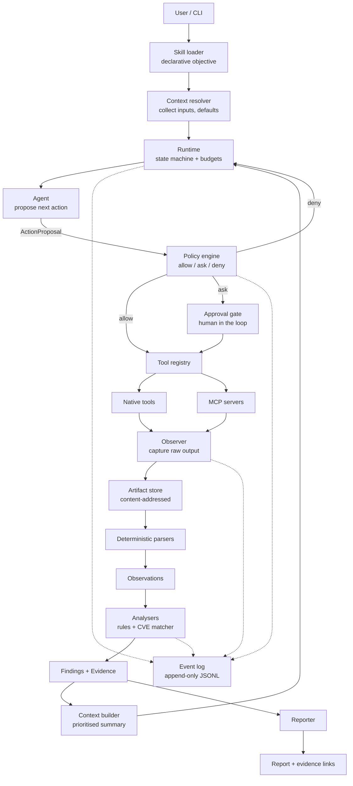
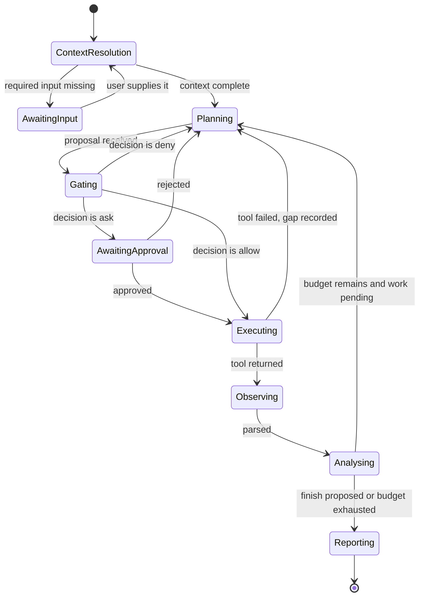

# 01 — Architecture

## 1. The governing principle: deterministic spine, probabilistic brain

The proposed design in the original conversation had the right instinct — separate the
harness from the agent — but it left the LLM as the *driver* of the loop. This plan
inverts that.

| | Deterministic spine | Probabilistic brain |
|---|---|---|
| Owns | Run lifecycle, state, budgets, policy decisions, tool invocation, parsing, artifact storage, finding construction, report rendering | Choosing the next action, writing the narrative, proposing hypotheses |
| Property | Reproducible, unit-testable, replayable | Non-deterministic, evaluated statistically |
| Failure mode | Bug — caught by tests | Wrong choice — caught by evaluation |

Everything that must be *provable* lives in the spine. Everything that benefits from
judgement lives in the brain. The boundary between them is a single typed object: the
**ActionProposal**.

Consequences that follow directly:

- The LLM never emits a shell command, a file path, or a CIDR. It emits a tool name plus
  arguments validated against that tool's schema.
- The LLM never decides whether something is in scope, and never decides what a CVE is.
  Those are lookups.
- The LLM never writes a finding. It writes narrative *about* findings the spine already
  constructed, and each narrative claim must cite finding and observation ids.
- Therefore a hallucinated CVE, a file write, or a scan of an unauthorised subnet are
  **type errors**, not behavioural problems we hope prompt engineering prevents.

## 2. Layers



The two dashed arrows matter: **the event log is written by the spine only**, never by the
model, and it is the single source of truth for replay, audit, and the UI.

## 3. The investigation loop

One iteration, in order. Steps 3–8 are the spine; step 4 is the only model call in the
hot path.

1. **Resolve context.** Load the skill, diff its declared inputs against supplied
   context, ask the user only for what is genuinely missing, apply configured defaults.
2. **Freeze the run.** Persist `run.json`: objective, scope, budget, skill version, tool
   versions, model id, and a `policy_context` snapshot. Nothing about these may change
   mid-run; a change requires a new run.
3. **Build the action catalogue.** Enumerate every action currently *available*: tools
   whose preconditions hold, whose capabilities the skill grants, and whose required
   inputs exist. Each entry carries its typed schema.
4. **Propose.** Call the model with the state digest and the action catalogue. It returns a
   `Proposal`: a *plan* (the intended sequence, with rationale) plus exactly one
   `next_action`. The plan is advisory — the spine never executes it unattended — but it is
   stored, rendered in the UI, and diffed each cycle, so adaptation is visible rather than
   implied. Validate against the schema; on invalid output, re-ask once with the validation
   error attached, then record a gap and continue.
5. **Gate.** The policy engine resolves the proposal to `allow`, `ask`, or `deny`.
   `ask` blocks on the approval gate and records the human decision as an event.
6. **Execute.** The tool runs inside the runner's sandbox with a wall-clock timeout. Raw
   stdout/stderr become artifacts with digests.
7. **Observe and parse.** Deterministic parsers turn artifacts into typed Observations
   with byte-range evidence. Unparseable or empty output becomes an EvidenceGap.
8. **Analyse.** Rule-based analysers and the CVE matcher derive Findings from
   Observations. Findings accumulate; nothing is overwritten.
9. **Check termination.** Stop if the agent proposed `finish`, or any budget is exhausted
   (steps, tool calls, tokens, wall clock, artifact bytes). Budget exhaustion is a normal,
   recorded outcome — not an exception.
10. **Report.** The reporter renders from structured state. Narrative is generated once, at
    the end, and is validated to cite only existing ids.

## 4. Component responsibilities

| Component | v1 scope | Deliberately excluded from v1 |
|---|---|---|
| Runtime | Loop, state machine, budgets, termination, resume-from-event-log | Parallel tool execution, sub-runs |
| Event log | Append-only JSONL, one event per transition, monotonic sequence | Distributed log, retention policy |
| Artifact store | Content-addressed `sha256`, sidecar metadata, provenance edges | Compression tiers, garbage collection |
| Parsers | nmap XML, auth log, nginx access log, JSON journald | EVTX, PCAP, cloud audit logs |
| Analysers | Rule engine with explicit rule ids; CPE→CVE version-range matcher | ML anomaly detection |
| Tool registry | Typed specs, native tools, MCP adapter | Marketplace, versioned remote registries |
| Policy engine | Scope check, capability grant, risk class, approval routing | Signed authorisation chains, RBAC |
| Context builder | Tiered digest + on-demand retrieval tools | Embeddings, vector store |
| Reporter | Deterministic markdown/JSON from structured state | PDF, dashboards, multi-format export |

Note the right-hand column. Each exclusion is a decision to keep the project finishable;
each is listed in the report as future work rather than half-built.

## 5. Run state machine



Every transition emits an event. The state machine is a plain Python enum plus a transition
table, so it is unit-testable without any model or network access — which is what makes
replay possible.

## 6. The ActionProposal contract

This is the entire model→spine interface. It is intentionally cramped: the model chooses
*among* actions, it does not compose them.

```json
{
  "plan": [
    { "step": 1, "action": "port_scan", "intent": "enumerate exposed services" },
    { "step": 2, "action": "cve_match", "intent": "map banners to candidate CVEs" },
    { "step": 3, "action": "http_probe", "intent": "conditional on an HTTP service being present" }
  ],
  "plan_change": { "revision": 2, "reason": "step 3 added: HTTP service discovered in step 1" },
  "next_action": {
    "kind": "tool",
    "grant": "g-7f21",
    "tool": "port_scan",
    "args": { "target": "lab-web-01", "profile": "service_detection", "ports": "top1000" },
    "expects": "Service list with product and version banners for HTTP and SSH.",
    "hypothesis_id": null
  }
}
```

or

```json
{ "kind": "finish", "reason": "All planned probes complete; two candidate findings require no further evidence." }
```

Constraints enforced by the spine, not by prompting:

- `tool` must exist in the catalogue supplied *this* step.
- `args` must validate against that tool's input model; unknown fields are rejected,
  not silently dropped.
- **`grant` is required, and there is no field for a raw target.** The model can only
  reference a capability grant minted during context resolution; the tool resolves the real
  host or path against that grant. An out-of-scope target has no representation in the
  schema, so "the agent cannot leave scope" is a property of the type system rather than a
  check that some code path might skip. See 03.
- `activity` values are attack-controlled and arrive as **quoted data blocks**, never as
  instructions; see 03.

## 7. Budgets and termination

| Budget | Default | On exhaustion |
|---|---|---|
| Max steps | 25 | Stop, report partial, record `budget_exhausted` |
| Max tool calls | 15 | Same |
| Max prompt tokens | 120k cumulative | Same |
| Max wall clock | 20 min | Kill running tool, stop |
| Max artifact bytes | 2 GB | Refuse further large captures, record gap |
| Max consecutive failures | 3 | Stop; three failures in a row means the plan is wrong |

The last one is the cheapest guard against the classic agent pathology: an LLM that
retries a failing tool forever. The spine counts, the brain cannot reset the counter.

## 8. Extension points

The extensibility claim is load-bearing for the project story, so the seams are explicit.

| Add a… | Requires editing | Does not require editing |
|---|---|---|
| Skill | one YAML file | runtime, policy, tools, report |
| Native tool | one tool module + registry entry | runtime, policy, event log, report |
| MCP server | one JSON config entry | any Python |
| Analyser rule | one rule file | runtime, tools, report |
| Report section | one template block | runtime, tools, policy |

Milestone 3 exists specifically to test this table: adding the `entry_point` skill must
produce a diff containing **only new files and one registry line**. If it touches the
runtime, the abstraction is wrong and gets fixed before the project is presented.

## 9. Deliberate departures from the original design

| Original proposal | This plan | Why |
|---|---|---|
| LLM owns the loop and chooses freely | LLM proposes; spine executes | Reproducibility, auditability, testability |
| Free-running ReAct loop | Plan-and-execute outer loop with an explicit, re-emitted plan object | Security investigations have no natural stop condition, so unbounded ReAct drifts; a stored plan is renderable, checkpointable, and shows adaptation as a diff |
| Policy gate that approves a target string | Capability grants minted at context resolution; tools accept grants, not targets | Converts scope enforcement from a checked invariant into a structural one |
| "Memory" as a component | No memory module; findings and artifacts accumulate in structured stores | A memory component with no retrieval contract is a vector database waiting to happen. Accumulation over immutable stores gives the same behaviour with none of the failure modes |
| Free-form tool output into context | Artifacts plus deterministic parser output; tiered context | Raw nmap and multi-GB logs do not fit, and reading them invites hallucination |
| Event bus as an architecture feature | Event log as the spine's write-ahead record | A bus implies subscribers and async delivery; an append-only log is a tenth of the work and directly enables replay |
| Policy as a checked step | Policy as the only path to execution | A check can be bypassed by a code path; a single choke point cannot |
| Bespoke YAML skill DSL and hand-written detection rules | Sigma format for log rules; Nuclei templates for active verification; skills stay a thin declarative wrapper | Reviewers ask "why not Sigma?". Reusing a validated format buys tooling, shareability, and credibility for less work than inventing one |
| Multi-agent planner/executor/critic | Single agent, plus a *deterministic* verifier | A critic without a verification signal is one LLM reviewing another. Re-probing a port and re-grepping a log line is real verification, and it is cheap |
