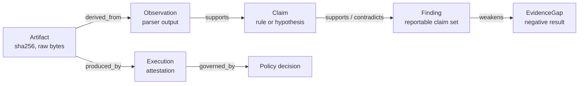

# 02 — Data Model, Provenance, and Context

## 1. The investigation graph is the state

Before this doc describes any record, the central decision: **the run's state is a typed
graph, not a transcript.** Nodes accumulate; the planner's job is to read the graph and
decide which open question to resolve next.



Three consequences worth stating plainly:

- **Provenance is free.** Every finding is reachable from raw bytes by following edges.
  There is no separate "evidence binding" step to forget to do.
- **Cross-source correlation is a graph query**, not a prompting technique. The
  `entry_point` skill correlates an auth-log observation with a port-scan observation by
  joining on a shared value, not by asking a model to hold both in context.
- **Negative results are nodes too.** A gap is a first-class record, which is what lets the
  report say "SSH was filtered, so this finding is inconclusive" instead of silently
  omitting the uncertainty.

Aggregation is mandatory, not optional: one `-sV -p-` scan emits thousands of observations.
Analysers emit rollup observations ("20 distinct source IPs, top 3 accounted for 91% of
failures") that the prompt consumes, and the raw rows stay queryable but unsent.

## 2. Artifact store

Content-addressed and append-only. Raw tool output is never parsed from a live stream and
never re-read implicitly.

```
runs/<run_id>/
  run.json                     frozen scope, budget, versions, policy snapshot
  events.jsonl                 append-only event log (section 6)
  provenance.jsonl             flat provenance triples (section 3)
  artifacts/<aa>/<sha256>      raw bytes, never mutated
  artifacts/<aa>/<sha256>.meta.json
  db/run.sqlite                normalized observations, claims, findings
  report.md / report.json
```

Sidecar metadata: `media_type`, `producer_execution_id`, `derived_from: [digest]`,
`bytes`, `created_at`, `nondeterminism` (`seed` or `"live-network"`). The `derived_from`
set is what makes the artifact layer a DAG rather than a pile.

## 3. Execution attestation

Every tool invocation writes exactly one attestation, in-toto shaped without the tooling.

```json
{
  "execution_id": "x-3f9a",
  "tool": "port_scan",
  "tool_version": "nmap 7.94",
  "argv": ["nmap", "-sV", "-oX", "-", "-p", "top1000", "10.13.37.10"],
  "cwd": "/runs/2026-09-15-01",
  "grant": "g-7f21",
  "policy_decision": "d-88c1",
  "started_at": "2026-09-15T09:12:04Z",
  "ended_at": "2026-09-15T09:12:57Z",
  "exit_code": 0,
  "stdout_sha256": "sha256:9f2c...",
  "stderr_sha256": "sha256:1b04...",
  "nondeterminism": "live-network"
}
```

`argv` is stored as an array, never a string. This is what makes replay, audit, and
"why did it run that command" answerable without trusting the model's account of itself.

## 4. Core records

Pydantic v2 models; JSON Schema exported at build time so the model's outputs and the
report both validate against the same definitions.

```python
class EvidenceRef(BaseModel):
    artifact: str            # "sha256:9f2c..." — a store key, never a filesystem path
    media_type: str          # "application/nmap+xml", "text/x-sshd"
    byte_start: int
    byte_end: int
    line_start: int | None = None
    line_end: int | None = None
    locator: str | None = None      # xpath / jsonpath, for locating within structured input
    span_sha256: str                # sha256(artifact_bytes[byte_start:byte_end])

class Observation(BaseModel):        # deterministic parser output; never model-authored
    id: str
    kind: Literal["service", "auth_event", "http_request", "rollup", "host_state"]
    value: dict[str, Any]           # proto, port, product, version, extrainfo, cpe, count...
    parser: str
    parser_version: str
    evidence: list[EvidenceRef]

class Claim(BaseModel):
    id: str
    statement: str
    assertion: Literal["observed", "rule_derived", "llm_hypothesis"]
    rule_id: str | None = None      # required unless assertion == "llm_hypothesis"
    supports: list[str] = []        # Observation ids
    contradicts: list[str] = []
    confidence: Literal["observed", "high", "medium", "low", "unknown"]
    confidence_basis: str           # machine-generated: rule id + matched range + db snapshot
    caveats: list[str] = []         # "backport_ambiguous", "db_snapshot=2026-08-01"

class Finding(BaseModel):
    id: str
    title: str
    status: Literal["possible", "confirmed", "not_affected", "inconclusive"]
    claims: list[Claim]
    cve: list[str] = []
    cpe: list[str] = []
    cvss: CvssScore | None = None
    epss: float | None = None
    kev: bool | None = None
    narrative: str | None = None    # the ONLY free-text field; never parsed back for facts
    gaps: list[str] = []            # EvidenceGap ids that weaken this finding

class EvidenceGap(BaseModel):       # negative results are records, not silence
    id: str
    kind: Literal["tool_timeout", "permission_denied", "empty_result", "partial_coverage",
                  "no_cpe", "db_stale", "unreachable", "budget_exhausted", "rejected_by_user"]
    scope: dict[str, Any]          # planned vs scanned vs excluded
    impact: str                    # which claims this weakens, and how
```

Two fields carry more weight than their size suggests:

- **`confidence_basis`** is machine-generated and names the rule, the matched version range,
  and the database snapshot date. "Why does the harness believe this?" is answerable without
  asking a model.
- **`severity` is absent by design.** Severity is derived from CVSS when a CVE exists, and
  otherwise from a fixed rubric keyed on observation kind and exposure. The model never
  assigns a severity number, because that is the single most confidently hallucinated value
  in every LLM security tool ever built.

## 5. The confirmation ladder

Vulnerability claims move up the ladder only through evidence, never through assertion.

| Status | Requires | Produced by |
|---|---|---|
| `possible` | Version falls inside a range in the vulnerability database | Deterministic matcher |
| `high` | Vendor-authored banner version **plus** a distribution-specific tracker match | Deterministic matcher |
| `confirmed` | An active verification artifact exists, with its own evidence span | A `HIGH` risk tool, explicitly approved |
| `not_affected` | A range check that positively excludes the version | Deterministic matcher |
| `inconclusive` | A gap blocks the check (no CPE, unreachable, stale database) | Spine, automatically |

The model's only power here is to *request* an active verification. It cannot promote a
finding; only a new artifact can.

### Mapping algorithm

```python
def map_services(observations, vulndb):
    for o in observations.of_kind("service"):
        cpe = o.value.get("cpe") or guess_cpe(o.value)   # nmap -sV emits CPE directly; prefer it
        if not cpe:
            yield EvidenceGap(kind="no_cpe", scope={"observation": o.id},
                              impact="no vulnerability check possible for this service")
            continue
        for match in vulndb.match(cpe):                   # NVD cpeMatch + OSV affected.ranges
            if not version_in_range(cpe.version, match):
                continue
            status, caveats = "possible", []
            if match.source == "nvd" and is_distro_version(o.value.get("extrainfo")):
                status, caveats = "low", ["backport_ambiguous"]     # 2.4.49-1ubuntu1.1
            elif match.source in {"ubuntu", "debian"} and release_matches(o, match):
                status = "high"
            yield Candidate(cve=match.cve_id, rule=match.rule_id, cpe=cpe, status=status,
                            basis=f"{match.source}:{match.range} vs {cpe.product}:{cpe.version}",
                            caveats=caveats, supports=[o.id])
```

Databases, all offline: NVD 2.0 JSON feeds into SQLite FTS5 or DuckDB; EPSS daily CSV for
prioritisation; CISA KEV JSON for the "actively exploited" flag. Every claim records
`db_snapshot`. An unfound CVE must render as *"no match in snapshot 2026-08-01, CPE-known
products only"* — never as "not vulnerable", because absence of a database match is not
evidence of absence.

## 6. Event log

Append-only JSONL, one line per transition, written by the spine only. This single file
delivers replay, audit, and UI progress — which is why the plan has no event bus.

```json
{"seq": 14, "ts": "2026-09-15T09:12:57.204Z", "run": "2026-09-15-01",
 "type": "TOOL_COMPLETED", "execution": "x-3f9a", "exit_code": 0,
 "stdout": "sha256:9f2c...", "duration_ms": 53012,
 "observations_added": 7, "findings_added": 0, "gaps_added": 0}
```

| Event type | Payload highlights |
|---|---|
| `RUN_STARTED` | objective, skill, skill version, scope digest, budget, model id |
| `CONTEXT_RESOLVED` | supplied, defaulted, and still-missing inputs; minted grants |
| `PLAN_PROPOSED` | plan revision, rationale |
| `PLAN_UPDATED` | previous revision, new revision, reason |
| `ACTION_PROPOSED` | tool, args digest, `expects` |
| `POLICY_DECIDED` | verdict, matched rule, grant, reason |
| `APPROVAL_REQUESTED` / `APPROVAL_GIVEN` | the human's answer, verbatim |
| `TOOL_STARTED` / `TOOL_COMPLETED` / `TOOL_FAILED` | execution id, digests, duration, exit code |
| `ARTIFACT_CREATED` | digest, media type, bytes, `derived_from` |
| `OBSERVATION_ADDED` | count by kind |
| `CLAIM_ADDED` / `FINDING_ADDED` / `GAP_ADDED` | ids |
| `VALIDATION_FAILED` | which invariant, and on what |
| `RUN_ENDED` | reason: `finished`, `budget_exhausted`, `aborted`, `error` |

`RUN_ENDED` always fires, including on crash, so a partially written run is still
interpretable.

## 7. Tool and skill contracts

```python
class ToolSpec(BaseModel):
    name: str
    description: str
    version: str
    input: type[BaseModel]          # JSON Schema exported for the catalogue
    output_media_type: str
    parser: str                     # deterministic parser key; "none" for unparsed
    capabilities: list[str]         # what the tool needs, e.g. net.connect, fs.read
    risk: Literal["LOW", "MEDIUM", "HIGH"]
    effects: str                    # human-readable side-effect description
    timeout_s: int
    idempotent: bool
```

```yaml
# skills/port_scan.yaml
name: port_scan
description: Enumerate exposed services on authorised targets and map them to candidate vulnerabilities.
version: 0.1.0
inputs:
  target:   { type: scope_target, required: true }
  ports:    { type: string, required: false, default: top1000 }
  profile:  { type: enum[discovery, service_detection], required: false, default: service_detection }
capabilities: [net.connect, net.raw, fs.write]
allowed_tools: [port_scan, service_enumerate, cve_match, http_probe, nuclei_check, finish]
outputs: [findings, observations, gaps]
budget_override: { max_steps: 12, max_tool_calls: 8 }
```

The skill grants a *ceiling*: a tool absent from `allowed_tools` never enters the action
catalogue, so the model cannot propose it, cannot be talked into proposing it, and cannot
have it appear in a prompt injection's reach.

## 8. Context budget

Order-of-magnitude reality check: a `-sV -p-` scan of one host is 100–400 KB of XML; a /24 is
2–15 MB; an nginx access log runs about 1 KB per line, so a busy day is ~10 GB; `auth.log`
is 10–200 MB.

| Tier | Contents | Reaches the prompt? |
|---|---|---|
| T0 | Raw artifact bytes | Never directly |
| T1 | Normalized rows in DuckDB (`ports`, `services`, `auth_events`) | Only via a query result |
| T2 | Code-computed rollups — top source IPs by failure count, time histogram, first/last seen, rare-value sweep | Yes, always: ~5–8k tokens, and roughly 80% of what the model actually needs |
| T3 | Retrieval tools the model can call: `query(sql)`, `grep_artifact(digest, regex, limit)`, `get_span(ref)` | On demand |
| T4 | Model-written summaries of row clusters | Labeled `derived`, always span-attached |

Budget allocation for a 32k prompt: system 2k, tool schemas 3k, state digest 8k, retrieved
spans 12k, dialogue 4k, reserve 3k. Eviction order is raw spans, then digest detail, then
dialogue. **Provenance is never evicted.** T2 being computed rather than generated is what
keeps a 10 GB log corpus at a few thousand tokens of context.

v1 uses FTS5/BM25 and SQL over T1 rather than embeddings. For a corpus where the expensive
questions are counting, ranking, and joining, a text index plus a query tool outperforms a
vector store and costs a fraction of the effort.

## 9. Invariants

Each of these is a test, not a hope. They are the contract the validator enforces at the end
of every run, and a violation is a recorded `VALIDATION_FAILED` event plus a failed test suite.

1. Every `Finding` has at least one `Claim`, and every `Claim` has at least one supporting
   `Observation`.
2. Every `Observation` has at least one `EvidenceRef` whose `span_sha256` recomputes from the
   named artifact's bytes.
3. No artifact path appears in any record: artifacts are referenced by digest only.
4. No `Claim` with `assertion="rule_derived"` lacks a `rule_id` that exists in the rule set.
5. No finding carries a CVE absent from the loaded database snapshot referenced by its own basis.
6. Every finding weakened by a gap lists that gap id, and its status is downgraded accordingly.
7. Every `ActionProposal` carries a `grant` that existed at the time of the proposal.
8. `events.jsonl` replays to the same set of finding ids and digests.

Invariant 3 exists because a path in a record is an invitation to re-read mutable state;
digests make the evidence immutable. Invariant 5 is the hallucination guarantee in its most
literal form: if it is not in the snapshot, it cannot be reported.

