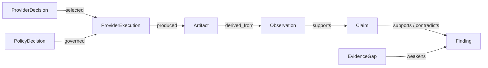

# 02 — Data Model, Provenance, Context, and Provider State

## 1. Two kinds of state: evidence and memory

The harness deliberately keeps **current-run investigation state** separate from **cross-run
memory**.

Current-run state is a typed provenance graph:



Cross-run memory is advisory context:

```text
memory/BASELINE.md    stable human-curated context
MEMORY.md             bounded active working memory
memory/long_term/*    durable selectively retrieved entries
```

A memory entry may point to old run ids for explainability, but **no memory node is accepted as
current-run evidence**. A finding validator only traverses the investigation graph.

## 2. Run layout

```text
runs/<run_id>/
  run.json                     frozen scope, budgets, model/provider config, memory digests
  events.jsonl                 append-only hash-chained event log
  provenance.jsonl             flat provenance triples
  provider-decisions.jsonl     necessity/router decisions and rejected candidates
  artifacts/<aa>/<sha256>      raw bytes, never mutated
  artifacts/<aa>/<sha256>.meta.json
  db/run.sqlite                normalized observations, claims, findings, provider state
  report.md
  report.json
  trace.jsonl                  prompts, responses, token ledger, retrieval/provider telemetry
  replay.json                  recorded model/provider responses for offline replay
```

`run.json` freezes the `BASELINE.md`, `MEMORY.md`, and selected long-lived-memory entry digests
used to build the initial context. Later memory mutation cannot retroactively change a run.

## 3. Artifact and execution records

Raw output is content-addressed and append-only. Native tools and MCP providers both produce an
execution envelope so provenance does not depend on implementation type.

```python
class ProviderExecution(BaseModel):
    id: str
    provider: str                 # "native:nmap" | "mcp:scanner-a"
    capability: str               # "service.enumerate"
    provider_version: str | None
    grant: str
    policy_decision: str
    necessity_decision: str
    started_at: datetime
    ended_at: datetime
    exit_status: str              # completed | failed | timeout | denied
    stdout_sha256: str | None
    stderr_sha256: str | None
    response_sha256: str | None   # structured MCP response if applicable
    nondeterminism: str           # local-tool | live-network | external-provider
```

For native command tools, argv is stored as an array in execution metadata. No shell command
string is ever reconstructed from model text.

## 4. Evidence records

```python
class EvidenceRef(BaseModel):
    artifact: str
    media_type: str
    byte_start: int
    byte_end: int
    line_start: int | None = None
    line_end: int | None = None
    locator: str | None = None
    span_sha256: str

class Observation(BaseModel):
    id: str
    kind: str
    value: dict[str, Any]
    parser: str
    parser_version: str
    provider: str
    execution_id: str
    freshness: datetime | None = None
    trust_class: str
    evidence: list[EvidenceRef]

class Claim(BaseModel):
    id: str
    statement: str
    assertion: Literal["observed", "rule_derived", "llm_hypothesis"]
    rule_id: str | None = None
    supports: list[str] = []
    contradicts: list[str] = []
    confidence: Literal["observed", "high", "medium", "low", "unknown"]
    confidence_basis: str
    caveats: list[str] = []

class Finding(BaseModel):
    id: str
    title: str
    status: Literal["possible", "confirmed", "not_affected", "inconclusive"]
    claims: list[Claim]
    cve: list[str] = []
    cpe: list[str] = []
    narrative: str | None = None
    gaps: list[str] = []

class EvidenceGap(BaseModel):
    id: str
    kind: Literal[
        "tool_timeout", "provider_failure", "permission_denied", "empty_result",
        "partial_coverage", "provider_conflict", "no_cpe", "db_stale",
        "unreachable", "budget_exhausted", "rejected_by_user"
    ]
    scope: dict[str, Any]
    impact: str
```

Finding **status** and claim **confidence** are intentionally separate. A high-confidence version
match can still be only a `possible` finding; only evidence that satisfies the confirmation rule
moves status to `confirmed`.

## 5. Capability proposal

The model-facing contract names a logical capability, never an MCP server or executable:

```python
class CapabilityProposal(BaseModel):
    grant: str
    capability: str
    args: dict[str, Any]
    expects: str
    evidence_needed: str
    hypothesis_id: str | None = None
```

The capability must be present in the catalogue supplied for that step, arguments must validate,
and the grant must already exist. The model does not supply a raw target or a provider id.

## 6. Provider specifications

```python
class ProviderSpec(BaseModel):
    id: str                       # native:nmap | mcp:scanner-a
    kind: Literal["native", "mcp"]
    capabilities: list[str]
    input_schema: dict[str, Any]
    output_media_type: str
    parser: str
    risk: Literal["LOW", "MEDIUM", "HIGH"]
    trust_class: Literal["local_tool", "local_mcp", "external_provider"]
    requires_network_egress: bool
    timeout_s: int
    idempotent: bool
    token_payload_hint: int | None = None
    latency_hint_ms: int | None = None
```

Multiple provider specs may advertise the same capability. Registration does not imply usage.

## 7. Necessity and routing records

Every requested capability produces a `ProviderDecision`, even when no provider runs:

```python
class ProviderDecision(BaseModel):
    id: str
    capability: str
    verdict: Literal["satisfied", "single", "expand", "defer", "deny"]
    selected: list[str]
    considered: list[str]
    rejected: dict[str, str]       # provider -> reason
    reason: str
    expansion_reason: Literal[
        "coverage_gap", "conflict_resolution", "independent_verification",
        "provider_failure", "trust_diversity"
    ] | None = None
    budget_snapshot: dict[str, int]
```

v1 rules require one provider by default. `expand` requires an `expansion_reason`; a third
provider additionally requires a skill-level override.

This record is the basis of provider-efficiency evaluation and the future v2 Token Optimizer.

## 8. Provider reconciliation

The correlator compares normalized observations, not provider prose:

```python
class Correlation(BaseModel):
    id: str
    key: str
    observation_ids: list[str]
    relation: Literal["agreement", "complement", "conflict"]
    detail: str
```

A `conflict` can create an `EvidenceGap(kind="provider_conflict")`. It does not silently select
the answer from whichever provider returned last.

## 9. Memory records

Long-lived memory is local and separately indexed:

```python
class MemoryEntry(BaseModel):
    id: str
    created_at: datetime
    kind: Literal[
        "tool_behavior", "investigation_pattern", "environment_fact",
        "user_convention", "lesson"
    ]
    summary: str
    source_runs: list[str]
    source_refs: list[str]
    confidence: Literal["stable", "provisional"]
    last_used_at: datetime | None = None
    supersedes: list[str] = []
```

Memory source references explain where a memory came from. They do **not** let a memory entry
satisfy a new run's `EvidenceRef` requirement.

Active-memory compaction records:

```python
class MemoryCompaction(BaseModel):
    id: str
    before_digest: str
    after_digest: str
    archived_snapshot: str
    promoted_entries: list[str]
    removed_duplicates: int
    local_model_used: bool
```

## 10. Context tiers

| Tier | Contents | Prompt policy |
|---|---|---|
| C0 | system/policy + capability schemas | always |
| C1 | `BASELINE.md` + bounded `MEMORY.md` | always, under fixed cap |
| C2 | current-run deterministic rollups | always, under fixed cap |
| C3 | selectively retrieved long-lived memory | only when relevant, labeled memory context |
| C4 | bounded evidence spans/query results | on demand, provenance attached |
| C5 | raw artifacts/provider payloads | never wholesale |

v1 uses fixed ceilings and eviction order. v2 may dynamically allocate these tiers, but evidence
provenance is never evicted from structured state even when evidence text leaves the prompt.

## 11. Token ledger

v1 records token usage without claiming optimality:

```python
class TokenLedgerEntry(BaseModel):
    step: int
    model_id: str
    tokenizer_id: str
    input_tokens: int
    output_tokens: int
    context_tokens_by_tier: dict[str, int]
    memory_tokens: int
    evidence_tokens: int
```

Provider execution also records payload bytes, normalized observation count, duplicates removed,
cache status, and whether the call changed a finding or closed a gap. These fields become the
training/evaluation trace for the v2 Token Optimizer.

## 12. Event log and hash chain

One canonical JSON event per line. Before hashing, omit `event_hash`, canonicalize the remaining
object, then compute:

```text
event_hash = SHA256(prev_event_hash || canonical_json(event_without_event_hash))
```

Representative events:

- `RUN_STARTED`, `CONTEXT_RESOLVED`, `MEMORY_RETRIEVED`;
- `PLAN_PROPOSED`, `CAPABILITY_PROPOSED`;
- `NECESSITY_DECIDED`, `PROVIDER_SELECTED`, `PROVIDER_REJECTED`, `CALL_SKIPPED`;
- `POLICY_DECIDED`, `APPROVAL_REQUESTED`, `APPROVAL_GIVEN`;
- `PROVIDER_STARTED`, `PROVIDER_COMPLETED`, `PROVIDER_FAILED`;
- `ARTIFACT_CREATED`, `OBSERVATION_ADDED`, `CORRELATION_ADDED`;
- `CLAIM_ADDED`, `FINDING_ADDED`, `GAP_ADDED`;
- `MEMORY_UPDATE_PROPOSED`, `MEMORY_COMPACTED`, `LONG_TERM_MEMORY_WRITTEN`;
- `VALIDATION_FAILED`, `RUN_ENDED`.

Replay verifies the event chain before reconstructing state.

## 13. Skill contract

Skills allow logical capabilities, not specific MCP names:

```yaml
name: port_scan
version: 0.2.0
inputs:
  target: {type: scope_target, required: true}
capabilities:
  - service.enumerate
  - vulnerability.match
  - http.probe
verification:
  max_providers_per_need: 2
  independent_for: []
budget_override:
  max_steps: 12
  max_provider_calls: 8
```

A provider absent from the registry cannot satisfy the capability. A capability absent from the
skill cannot enter the action catalogue.

## 14. Invariants

1. Every finding has at least one claim; every non-hypothesis claim has supporting observations.
2. Every observation has evidence whose span hash recomputes from an immutable artifact.
3. No memory entry can appear where an `EvidenceRef` is required.
4. No CVE is reported unless present in the recorded vulnerability snapshot.
5. Every capability proposal references a valid grant and an allowed capability.
6. Every provider execution references a prior necessity decision and policy decision.
7. Every `expand` provider decision contains an allowed expansion reason.
8. Provider conflicts remain represented until resolved or reported as a gap.
9. `MEMORY.md` never exceeds its configured cap after post-run compaction.
10. Event-chain verification succeeds before replay.
11. Replay produces the same structured finding ids/digests without live provider calls.
12. A remote model/provider receives memory/evidence only when an explicit egress policy permits it.
